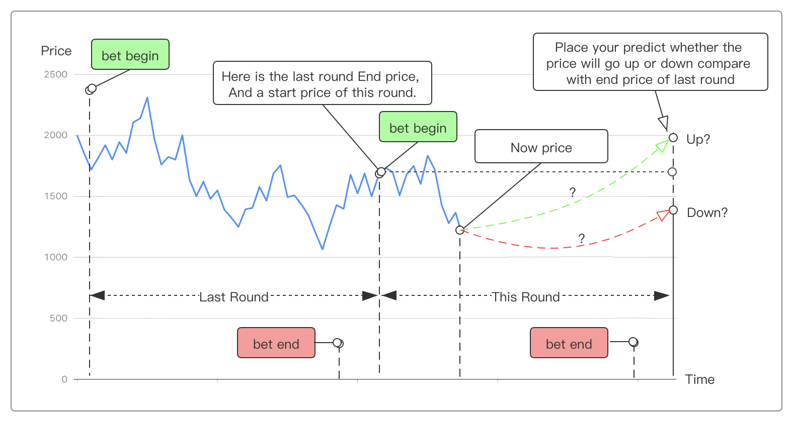

# Game Rules

[ [中文版遊戲規則說明](./GameRule_cn.md) ]

1. Users predict whether the price of WAN/BTC will rise or fall within a time period (8 hours).

2. Users can place a bet on whether the price will go up or down within the first 6 hours of the period.

3. Betting is closed 2 hours before the end of the period.

4. If the price rises during the 8 hour period, users who bet "UP" win, if the price falls during the period, users who bet "DOWN" win.

5. The losing side's bets are distributed to the winning side in proportion to the size of each individual's bet vs the total bets for the winning side.

6. 10% of the each bet will be pooled in a prize pot to be rewarded once per 3 days to 20 lucky users who participated in the game.

7. The remaining 90% shall be divided amongst the winners in each period. Losers will receive nothing and winners will receive an amount equal to the proportion of their bet vs the total amount of all winning bets. 

8. Regardless of winning or losing the Up/Down bet, all players have a chance of winning the prize pot.

9. Wanchain's on chain random number generation will be used to decide the prize pot winners.
